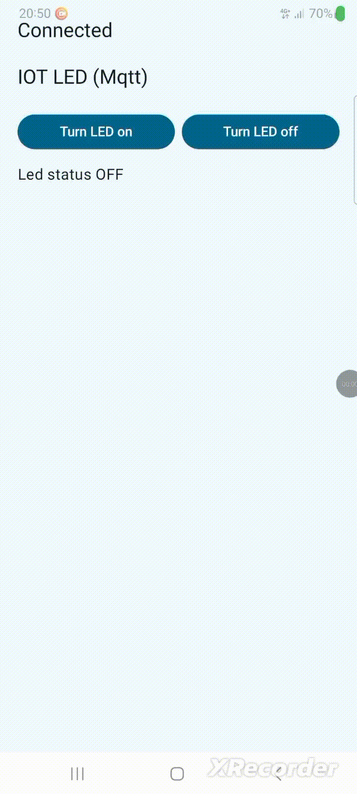

# MQTT LED Control

## 📌 Motivation  
This project demonstrates how to control an LED diode on a **Raspberry Pi Pico W** through **MQTT messages**, with an Android app as the client.  
The goal is to show **IoT communication between microcontrollers and mobile devices**, and how MQTT can be used for lightweight, real-time messaging.  

---

## ⚙️ Features  
- ✅ Toggle LED on the Raspberry Pi Pico via MQTT messages  
- ✅ Publish status updates from Pico to the broker  
- 🚧 Android app subscribes to messages (publishing works, but receiving still under development)  
- ⚡ Uses **lightweight MQTT protocol** suitable for IoT applications  

---

## 🛠️ Hardware & Software  
- Raspberry Pi Pico W  
- Onboard LED (or external LED with resistor)  
- MQTT Broker (e.g., Mosquitto, HiveMQ, EMQX)  
- Android App (custom client for sending commands & receiving messages)  

---

## 🔧 Setup  

### 1. Clone the repository  
<pre>
  <code>
git clone https://github.com/milutin2002/mqttLedControl.git
cd mqttLedControl
  </code>
</pre>

### 2. Build & flash Pico firmware
<pre>
  <code>
cd pico
mkdir build
cd build
cmake ..
make
  </code>
</pre>

### 3. Connect Android App

Configure the app to connect to the same broker (IP / hostname).

Use topic names defined in the Pico code (e.g., led/pico/set, led/pico/status).

## ▶️ Usage

Send on or off messages to led/control to toggle the Pico’s LED.

Pico publishes LED state updates to led/status.

Android app sends control messages and is intended to display status updates (currently in progress).

## 🎬 Demo Videos

### 🔹 LED Toggle Demo

### 🔹 Android Control Demo

## 🐞 Known Issues / To Do

Improve UI of Android client.

## 📄 License

MIT License – feel free to use and modify.

